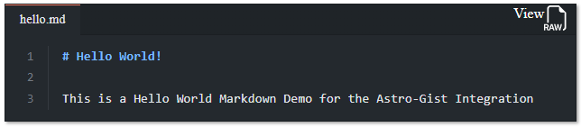

# `Astro-Gists`

This is an [Astro integration](https://docs.astro.build/en/guides/integrations-guide/) that allows the user to import GitHub Gists by ID through an Astro Component and Octokit

## Example



## Usage

### Prerequisites

The Only Requirement to install this package is a **Github account with a Verified Email** to be able to create a Personal Access Token.

This Integration uses [`Octokit`](http://octokit.github.io/) by `GitHub` to Generate custom gists using [`ExpressiveCode`](https://expressive-code.com/) within your Astro project!

### Installation

Install the integration **automatically** using the Astro CLI:

```bash
pnpm astro add @matthiesenxyz/astro-gists
```

```bash
npx astro add @matthiesenxyz/astro-gists
```

```bash
yarn astro add @matthiesenxyz/astro-gists
```

Or install it **manually**:

1. Install the required dependencies

```bash
pnpm add @matthiesenxyz/astro-gists
```

```bash
npm install @matthiesenxyz/astro-gists
```

```bash
yarn add @matthiesenxyz/astro-gists
```

2. Add the integration to your astro config

```diff
import { defineConfig } from "astro/config";
+import astroGist from "@matthiesenxyz/astro-gists";


// https://astro.build/config
export default defineConfig({
+  integrations: [astroGist()]
});
```

### Configuration

Setup your `.env` file with the following secret from github:

Github Personal Access Token (Classic) 
 - No Special Permissions required 
 - Octokit recommends creating an empty token for this!

```dotenv
GITHUB_PERSONAL_TOKEN=ghp_YOURPERSONALTOKENHERE
```

### Usage

#### `<GetGist>`

This Utility is meant to display Gists as Codeblocks using ExpressiveCode for Astro instead of Scripted Elements using the default Gist method

```astro
---
import { GetGist } from "@matthiesenxyz/astro-gists/components"
---
<GetGist 
	gistId="your-gist-id-here"
	filename="name-of-desired-file-to-be-displayed.md" 
/>
```

## Contributing

This package is structured as a monorepo:

- `playground` contains code for testing the package
- `package` contains the actual package

Install dependencies using pnpm: 

```bash
pnpm i --frozen-lockfile
```

Start the playground:

```bash
pnpm playground:dev
```

You can now edit files in `package`. Please note that making changes to those files may require restarting the playground dev server.

## Licensing

[MIT Licensed](./LICENSE). Made with ❤️ by [AdamMatthiesen](https://github.com/AdamMatthiesen) Under [MatthiesenXYZ](https://github.com/MatthiesenXYZ).

## Acknowledgements

- [`Octokit`](http://octokit.github.io) by GitHub
- [`Expressive-Code`](https://expressive-code.com/) By Hippotasic
- [`astro-integration-kit`](https://github.com/florian-lefebvre/astro-integration-kit) by Florian